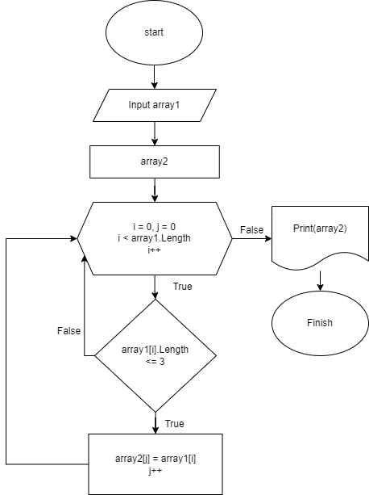

# Здравствуйте!
Вы сейчас читаете описание того, как работает эта программа.

## Введение

Данная программа предназачена для сортировки предложенного массива по критерию "элемент состоит из 3 знаков и менее".

## Составление проекта

Для начала была составлена блок-схема для определения "эскиза" проекта:

Уже по составленной блок-схеме был написан код на языке С#

### Работа программы

Программа при начале работы предлагает Вам ввести длинну массива, после этого предлагает заполнить массив самостоятельно.
После окончания ввода программа самостоятельно формирует второй массив, учитвая вышеуказанное условие: *"элемент состоит из 3 знаков и менее"*